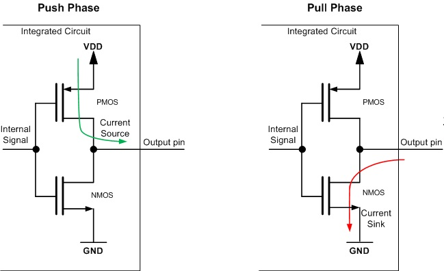
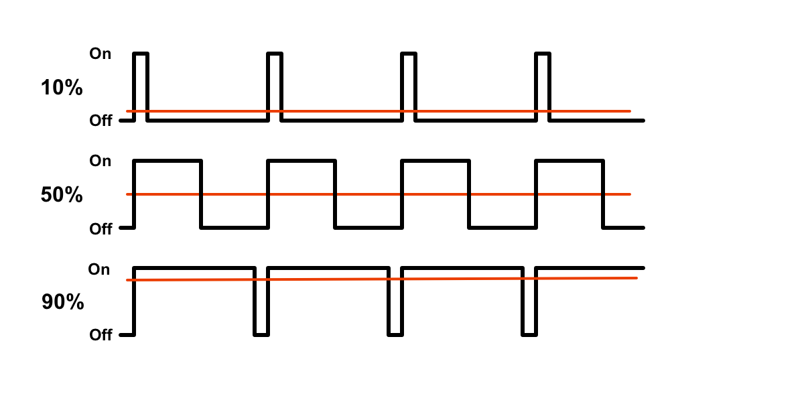

# Embedded System Lecture

 본 문서는 서울시립대학교 중앙동아리 ZETIN의 신입생 교육을 위한 것으로, 간단한 전기전자 이론을 비롯하여 로봇을 만드는 데에 필요한 임베디드 관련 내용들을 최대한 이해하기 쉽게 정리했습니다. 본 교육과정에서는 STM32F411 MCU 기반의 Nucleo-F411 개발 보드 및 이에 맞추어 만들어진 PCB를 사용합니다.

## 목차

[TOC]

## 전기전자 이론

 이 섹션에서는 라인트레이서를 제작하기 위한, 더 나아가 로봇 및 전기전자분야를 공부하기 위한 간단한 전기전자 기초에 대해 알아봅니다. 이 내용에 익숙하다면 대충 훑고 넘어가도 좋습니다.

 전기 전자 이론에서 필수적으로 알아야 할 세 가지 요소가 바로 전압, 전류, 저항입니다. 이 세 가지 요소에 대해 먼저 알아보도록 하겠습니다.

### 전압 ( Voltage [V] )

 먼저 전압에 대해 알아보겠습니다. 사실 전압은 전위의 차이로 정의되기 때문에, 전위가 무엇인지 알아야 전압을 이해할 수 있습니다. 모든 입자는 +,- 두 가지 종류의 전하를 띠고 있어 같은 전하를 띠는 것들끼리는 밀어내고 다른 전하를 띠는 것들끼리는 당깁니다. 대표적으로 원자핵은 +전하를 띠고 있으며, 전자는 -전하를 띠고 있어 원자핵과 전자는 서로 결합해서 하나의 원자를 이룹니다.

 이때 중력으로 인한 중력 위치 에너지를 정의할 수 있듯이, 전기력으로 인한 전기 위치 에너지를 정의할 수 있습니다. 높은 곳에서 낮은 곳으로 물체가 떨어지면 위치에너지가 다른 에너지로 전환되듯이, 전기 위치 에너지가 높은 곳에서 전기 위치 에너지가 낮은 곳으로 전하를 가진 입자가 이동하면 전기 위치 에너지가 다른 에너지로 전환됩니다. 이때, **단위 전하당** **전기 위치 에너지**를 줄여서 **전위**라 부릅니다. 전기 위치 에너지의 단위는 줄[J]이며, 전위의 단위는 볼트[V]입니다.

> 이렇게 위치에 의해서 잠재적으로 일을 할 수 있는 능력을 위치 에너지, 혹은 포텐셜 에너지(잠재적 에너지)라 부릅니다.

 그런데 이 전위라는 것은 사실 큰 의미를 가지지 않습니다. 왜냐하면 전위가 아무리 높거나 낮더라도, 똑같은 전위 내에서 움직이면 아무런 에너지를 얻을 수 없기 때문입니다. 예를 들어 해발고도가 30미터나 되는 높은 곳에 무거운 물체가 있다고 합시다. 그런데 알고보니 그냥 그 지역 자체가 지반이 높은 곳이었고, 그래서 사실 그 물건은 그냥 바닥에 놓여져있을 뿐이었습니다. 그러면 우리는 이 물체가 큰 에너지를 만들어내리라고는 기대할 수 없을 것입니다. 반면, 어떤 물체의 해발고도가 0미터라고 합시다. 그런데 그 지역은 오히려 해발고도보다 지반이 낮은 곳이라서, 이 물체는 높은 탑 꼭대기에 올려져있는 상태였습니다. 그러면 우리는 이 물체를 탑에서 떨어트림으로써 큰 에너지를 얻을 수 있을 것입니다.  이와 같이 전위는 그 절대적인 값은 의미가 없고, 두 지점간의 전위 차만이 물리적으로 의미를 갖습니다. 전위 이 **전위 차이**를 **전압**이라 부릅니다. 전압은 전위의 차이이므로, 그 단위는 마찬가지로 V(볼트)입니다.

 따라서 우리가 1.5V, 220V와 같이 어떤 전압을 말할 때에는, 마치 절대적인 어떤 값을 말하는 것 같지만 실은 두 지점간의 전위 차이를 말하는 것입니다. 1.5V 건전지의 경우 +극과 -극의 전위 차이가 1.5V라는 의미이며, 절대적인 전위가 얼마인지는 전혀 알 수가 없고 중요하지도 않습니다. 마찬가지로 가정용 콘센트에 들어오는 220V 역시 콘센트의 두 극 사이 전위 차이가 평균적으로(교류이므로) 220V라는 것이지, 그 절대적인 전위가 220V라는 것은 아닙니다. 실제 전위는 -110V, +110V일 수도 있고, 0, 220V일 수도 있고, 심지어 1000, 1220V일 수도 있습니다.

 이것을 이해하면 왜 건전지를 아래와 같이 연결했을 때 전류가 흐르지 않는지 알 수 있습니다.


 만약 건전지가 절대적으로 0V, 1.5V를 만들어주는 장치였다면 전위 차가 있으므로 전류가 흘렀을 것입니다. 그러나 건전지는 단지 자기 자신의 양극의 차이가 1.5V가 되도록 해주는 장치일 뿐이므로 위와 같이 구성하면 전류가 흐르지 않습니다. 전류가 흐르려면 회로를 만들어주어야 합니다.

#### 그라운드

 그런데 때로는 절대적인 전위가 있다고 가정하는 편이 편리할 때가 있습니다. 마치 건축물을 지을 때에는 해발고도라는 절대적인 기준을 사용하는 것과 비슷합니다. 건축물에서 해발고도라는 개념을 사용할 수 있는 이유는 바다가 너무가 거대하여 아무리 물을 많이 붓거나 뺀다고 해도 그 높이가 바뀌지 않기 때문입니다. 전위도 마찬가지로, 절대적인 전위의 기준을 삼기 위해서는 아주 커다란 물체라서 전자를 아무리 많이 넣거나 빼도 그 전위가 바뀌지 않는 물체가 필요합니다.

 과학자들은 주변에서 볼 수 있는 물체들 중 가장 큰 물체인 지구 자체를 그 기준으로 삼기로 했습니다. 그래서 만약 절대적인 전압이 필요할 경우에는 지구 그 자체를 기준으로 해서 전위를 결정합니다. 이 지구의 전위, 혹은 지구의 전위와 똑같이 맞춰놓은 전위를 **그라운드**라 부릅니다. 실제로 높은 전압을 사용하는 가전제품의 경우 지구의 전압과 가전제품에서 사용하는 기준 전압을 똑같이 맞추기 위해 가전제품을 그냥 땅과 바로 연결해버립니다.

 

 콘센트를 보면 플러그가 직접 들어가는 곳 말고도 위아래로 조그맣게 튀어나온 쇳조각이 있습니다. 이것이 바로 그라운드로, 이 부분은 실제로 건물 내의 철근을 통해 땅과 직접 연결되어있습니다. 이렇게 회로를 땅에 붙여버린다고 해서 그라운드를 우리말로 **접지**라고 부릅니다.

 그리고 이러한 이유에서 실제로는 땅과 접지되어있지 않다 하더라도 회로에서 기준이 되는 전압을 관습적으로 그라운드라 부릅니다. 만약 그라운드를 정해놓지 않는다면 몇 볼트인지를 표기할 때 어떤 두 지점 사이의 전위차를 말하는 건지 일일히 써 주어야겠지만, 그라운드를 정의함으로써 아무 맥락 없이 몇 볼트인지만 적어놓더라도 그것이 그라운드를 기준으로 잰 전위차임을 쉽게 알 수 있습니다. 물론 기준점이 그라운드이므로 그라운드의 전위는 0V입니다.

 회로도에서는 그라운드를 다음과 같이 다양한 기호들로 표현합니다.


 이렇게 기호가 다양한 것은 그라운드의 목적에 따라 그라운드를 어느 정도 분리하기 위함입니다. 물론 회로 전체에서 그라운드는 모두 연결되어 오직 하나만이 존재합니다. 그러나 모터 등과 같이 노이즈가 많이 발생하는 회로의 그라운드와 센서와 같이 노이즈가 섞이면 안 되는 부분을 다른 모든 곳에서 분리하고, 전원 바로 근처에서 딱 한 번만 연결해주면 노이즈가 센서 등 민감한 곳으로 섞이는 것을 막을 수 있습니다. 만약 위 

### 전류 ( Current [A] )

 전류는 전압에 비해 상대적으로 쉽게 이해할 수 있습니다. 어떤 한 단면을 단위시간당 지나는 전하량을 전류라 부릅니다. 일반적으로 회로는 도선에 전자가 흐르기 때문에 도선의 한 단면을 1초당 지나는 전자가 아보가드로 수만큼 있을 때 그 도선에 1 암페어(A)의 전류가 흐른다고 정의해도 무방합니다. (물론 한 방향으로 지나가는 것을 말하는 것입니다. 한 도선 내에서 같은 개수의 전자가 왼쪽에서 오른쪽, 오른쪽에서 왼쪽으로 동시에 흐르면 전체 전류는 0입니다.)

>  그러나 매우 특수한 경우이기는 하지만 도선에 전자가 흐르는 것이 아니라 그냥 진공상태에서 전자 빔을 쏘거나, 아니면 전하를 가진 이온이 움직이는 경우도 전류라 부를 수 있습니다. 또한 실제로 전하가 이동하지 않고 전기장을 통한 에너지만 이동하는 경우에도 변위 전류(displacement current)라는 것을 정의할 수 있습니다만, 이런 특수한 케이스들은 지금은 크게 중요하지 않으므로 여기서는 다루지 않겠습니다.

 전류는 항상, 전위가 높은 곳에서 낮은 곳으로 흐릅니다. 마치 물이 높은 곳에서 낮은 곳으로 흐르는 것과 같습니다. 만약 높은 곳의 물이 낮은 곳으로 전부 흘러버리면 더이상 물이 흐르지 않을 것입니다. 물이 계속 흐르게 하려면 낮은 곳의 물을 높은 곳으로 다시 퍼 올려야 합니다. 바로 전지나 전원장치가 그런 일을 해 줍니다. 위에서 전위는 높이와 비슷한 것이라 했습니다. 1.5V의 전원 장치라는 것은, 낮은 곳(-극)의 물을 높은 곳(+극)으로 퍼올려주는 장치인데, 낮은 곳과 높은 곳의 높이 차이가 항상 1.5V가 되도록 퍼올리는 양을 조절해주는 장치라 볼 수 있습니다.

 다만 전류에서도 헷갈림 포인트가 하나 있습니다. 아주 옛날 사람들이 처음 전류라는 것을 발견할 때에는 전류가 한 방향으로 흐르기는 하는데, 대체 무엇이 그런 현상을 만드는지는 알지 못했습니다. (전자가 발견된 것은 1906년 조지프 존 톰슨에 의해서입니다. 의외로 그렇게 오래되지 않았습니다.) 그래서 임의로 한 극을 +, 한 극을 -라 하고, 어쨌든 전류는 +에서 -로 흐른다고 정의해버렸습니다. 그런데 나중에 과학이 발전하여 밝혀진 바에 따르면, 정작 흐르는 것은 +극을 가진 원자핵이 아니라 -극을 가진 전자였습니다. 그래서 **전류는 +에서 -로 흐르지만**, 그 전류를 흐르게 하는 것은 -전하를 가진 전자이기 때문에 **전자는 -에서 +로 움직입니다.** 이것은 마치 물 속의 공기방울이 물 아래에서 위로 올라오는 것처럼 보이지만 사실은 물이 공기방울 위에서 밑으로 내려간다는 것과 비슷하게 이해하면 나름 그럴듯하게 이해할 수 있습니다.

### 저항 ( Resister [Ω] )

 저항은 전류를 방해하는 정도를 말합니다. 구체적으로는 물질 내부에서 전자가 이동할 때 원자핵에 의해 전자의 흐름이 방해받으면서 발생합니다. 저항의 단위는 옴(Ω)이며, 오메가 기호를 써서 표기합니다. 구체적으로, 어떤 물체의 저항은 그 물체에 가해지는 전압과 전압을 걸었을 때 발생하는 전류의 비입니다. 일반적으로 물체에 전압을 가하면 그 전위차로 인해 전류가 흐르게 되는데, 이때 흐르는 전류는 전압과 비례하는 특성이 있습니다. 즉, 아래와 같이 전압과 전류의 관계가 선형적입니다. 이때 이 기울기의 역수를 저항이라 합니다. 저항이 크면 기울기가 낮으므로 전압을 많이 올려도 전류가 조금밖에 늘어나지 않습니다. 반면 저항이 작으면 기울기가 크므로 전압을 조금만 올려도 전류가 많이 늘어납니다.


 물론 어떤 물체는 그 물체에 걸어 준 전압과 전류가 이렇게 선형적으로 변하지 않는 경우도 있으며, 심지어 전류를 걸어주는 방향에 따라 저항이 다르게 나타나는 경우도 있습니다. 대표적으로 다이오드가 그러한 예입니다. 또 저항이 일정하다 하더라도 온도에 따라 값이 달라질 수 있습니다.

 저항에서 알아둬야 할 중요한 성질은 저항의 합성입니다.

 

 저항은 위 그림과 같이 순차적으로 연결하거나, 아니면 나란히 연결할 수 있습니다. 전자를 직렬, 후자를 병렬 연결이라 합니다. 직렬 연결의 경우 두 저항을 합한 총 저항값은 $R_1+R_2$로, 단순히 두 저항값의 합으로 주어집니다. 반면 병렬 연결의 경우 좀 더 복잡해서, 저항값이 $\frac{1}{\frac{1}{R_1}+\frac{1}{R_2}}$로, 두 저항값의 역수의 합의 역수로 주어집니다. 이 식을 간단히 정리해서 $\frac{R_1R_2}{R_1+R_2}$로 기억해도 무방합니다.

 저항은 직렬 연결할 경우 위 식에 따라 저항값이 더 커집니다. 반면 저항을 병렬 연결할 경우 병렬 연결한 저항들 중 가장 작은 저항보다 더 작아집니다. 그런데 저항을 직렬 연결하거나 병렬 연결할 필요 없이, 애초에 적절한 저항 하나만 쓰면 되지 굳이 저렇게 복잡하게 연결을 할 필요가 있을까요?

 일반적으로 저항이라 하면 아래와 같은, 전류의 방해를 위한 저항기(Resister)를 말합니다.


 그러나 어쨌든 전류를 방해하기만 하면 정의상 저항이라 볼 수 있기 때문에, 전구, 모터 등 일반적으로 전기 에너지를 소모하는 것들은 전부 다 저항이 됩니다. 따라서 저항기만을 사용할 때에는 적절한 저항 하나만 사용하면 되겠지만, 저항기가 아닌 전구나 모터 등이 저항으로 작용하는 경우에는 여러 부품이 직, 병렬로 연결되므로 저항이 여러 개 있을때의 전압, 전류를 분석하기 위해 이런 복잡한 연결을 알아야 하는 것입니다.

### 옴의 법칙

 사실 앞서 설명한 전압, 전류, 저항에 대한 것은 이 옴의 법칙 하나를 설명하기 위해서라 해도 과언이 아닙니다. 옴의 법칙이란 구체적으로 전류, 저항, 전압의 관계에 대해 설명한 것으로, 아래와 같은 간단한 식 하나로 설명할 수 있습니다.
$$
V=IR
$$
 이는 풀어 설명하면 다음과 같습니다.

- $R$의 크기를 갖는 저항에 $I$만큼의 전류가 흐른다면, 그 저항의 양단 전위의 차는 $IR$만큼이 된다.
- $R$의 크기를 갖는 저항에 $I$만큼의 전류가 흐르게 하려면 그 저항의 양단에 $IR$만큼의 전위차를 만들어 주어야 한다.
- $R$의 크기를 갖는 저항의 양단 전위 차이가 $V$만큼이라면, 그 저항을 통해서 $V/R$만큼의 전류가 흐를 것이다.
- 어떤 저항의 양단에 $V$만큼의 전위차가 있을 때 그 저항에 $I$만큼의 전류가 흐른다면 그 저항의 크기는 $V/I$이다.

 이때 위의 설명들에서 저항을 매우 강조해서 설명한 것을 볼 수 있습니다. 그 이유는 $V=IR$이라는 옴의 법칙은 하나의 저항에 대해 성립하는 것이기 때문입니다. 이 공식을 처음 배우는 경우 *하나의* 저항에 대해 $V$와 $I$를 따져야 하는데 서로 다른 곳의 값들을 계산하는 실수가 매우 잦습니다. 예를 들어서 아래 회로에서 저항 $R_2$에 흐르는 전류를 계산해야한다고 가정해봅시다.


 이 경우 잘못 생각하면 $V=IR$이므로 $I=V/R_2$라고 생각할 수도 있습니다. 그러나 이 경우 $V=IR$에서 $R$은 가운데의 저항만을 골랐으면서, $V$는 세 저항 전체에 걸리는 전압을 골랐으므로 이는 잘못된 적용입니다. 올바르게 적용하기 위해서는 세 개의 저항을 합쳐서 $R_1+R_2+R_3$의 크기를 갖는 하나의 저항으로 생각한 뒤, 이 저항에 걸리는 전압이 $V$임을 고려해서 $I=V/(R_1+R_2+R_3)$가 올바른 답이 됩니다. 또한 그렇기 때문에 다시 한 번 $V=IR$을 적용하면 $R_2$에 걸리는 전압은 $V\frac{R_2}{(R_1+R_2+R_3)}$임을 알 수 있습니다.

### 옴의 법칙의 응용

 옴의 법칙을 응용하여 가변저항을 해석해보겠습니다. 저항을 사용한 전압 분배는 매우 자주 사용되는 패턴이므로 잘 알아두어야 합니다. 먼저 가변저항은 말 그대로 저항값을 바꿀 수 있는 저항을 말하는 것으로, 보통 아래와 같이 생겼습니다.


가변저항은 일반적으로 다음과 같은 내부 구조를 가지고 있습니다.


즉, 1번과 3번 핀 사이에 저항이 큰 물질이 연결되어있으며, 2번 핀이 1번 핀과 3번 핀 사이를 움직이는 구조입니다.

- 만약 2번 핀이 1번 핀에 가깝다면 1번과 2번 사이 저항은 줄어들고 2번과 3번 사이 저항은 커집니다.
- 만약 2번 핀이 3번 핀에 가깝다면 1번과 2번 사이 저항은 커지고 2번과 3번 사이 저항은 줄어듭니다.

물론 1번핀과 3번핀 사이의 저항은 2번 핀의 위치에 관계없이 일정할 것입니다.

가변저항을 해석하기 위해 가변저항의 구조를 다음과 같이 간단히 표현해봤습니다.


 $R_1, R_2$의 값은 가변저항을 돌리는 정도에 따라 달라질 것입니다. 이때 우리가 아는 것은 $R_1$, $R_2$, $V_1$, $V_3$입니다. 구하고자 하는 것은 $V_2$입니다. `Pin 2`는 아무 곳에도 연결되어있지 않다고 가정하겠습니다. (만약 다른 곳에 연결되어있다면 전압을 확실히 결정할 수 없습니다.) 추가적으로 위 회로도에서는 $V_1$이 전압이 높은지 $V_3$이 높은지 알 수가 없습니다. 그러나 그냥 $V_1$이 더 높다고 가정하겠습니다. 어차피 위아래를 뒤집어도 별 문제 없는 회로니까요. 즉, 전류는 위에서 아래로 흐른다고 가정하겠습니다.

1. 먼저 이 회로의 전체 저항인 $R_1+R_2$에 흐르는 전류를 알아보겠습니다.  $R_1+R_2$의 양단 전위 차는 $V_1-V_3$이고, 저항은 $R_1+R_2$이므로 옴의 법칙을 적용하면 전류는 $\frac{V_1-V_3}{R_1+R_2}$가 됩니다.
2. 그리고 다시 옴의 법칙을 $R_2$에 대해 적용해보면 $R_2$의 양단 전위 차는 $R_2\frac{V_1-V_3}{R_1+R_2}$가 됩니다.
3. $R_2$의 양단 전위 차를 알았으므로, $V_3$에 이 값을 더하면 $V_2$가 됩니다. 즉, $V_2=V_3+R_2\frac{V_1-V_3}{R_1+R_2}$입니다.

이 식을 정리하면 아래와 같이 쓸 수 있습니다.
$$
V2=\frac{(R_1+R_2)V_3+R_2(V_1-V_3)}{R_1+R_2}\\
=\frac{R_1V_3+R_2V_3+R_2V_1-R_2V_3}{R_1+R_2}\\
=\frac{R_1V_3+R_2V_1}{R_1+R_2}
$$

 이 식은 가만히 살펴보면 내분점 공식과 동일한 식입니다. 즉, 저항 두 개를 직렬로 연결하면 가운데부분의 전위는 $V_1,V_3$를 $R_1:R_2$로 내분했을 때의 전위가 됩니다.

 그리고 보통 이런 회로의 경우, $V_3=\text{Ground}$인 경우가 많습니다. 그런 경우 $V_3=0$, $R1+R2=R$이라 두고 식을 정리하면 다음과 같이 식이 간단해집니다.
$$
V_2=V_1\frac{R_2}{R}
$$
즉, 가변저항을 돌리는 정도에 따라 $V_2$가 $0$에서 $V_1$ 사이를 움직인다는 것을 쉽게 알 수 있습니다.

## 임베디드시스템 이론

이 섹션에서는 라인트레이서를 제작하기 위한 임베디드시스템의 기초에 대해 알아봅니다.

### 임베디드 시스템, MCU

 우리 동아리에서는 임베디드 시스템을 다룹니다. 임베디드시스템이란, 다양한 일을 할 수 있도록 (=범용 목적의) 제작된 일반적인 컴퓨터(데스크톱이나 노트북 등)와 다르게 특정한 작업만을 수행하기 위해 만들어진 작고 간단한 컴퓨터라 볼 수 있습니다. 예를 들어 전자레인지, 냉장고, 엘리베이터 등 각종 전자기기 내부에는 이들을 제어하기 위한 컴퓨터가 들어있는데, 이런 것들을 말합니다. 물론 우리 동아리에서 만드는 로봇에 들어가는 컴퓨터 역시 임베디드시스템에 속합니다.

 이런 임베디드시스템은 보통 크기를 작게 하기 위해 많은 부품들이 전부 하나의 칩 안에 들어가 있는 형태로 제작됩니다. 우리가 일반적으로 사용하는 데스크톱이나 노트북을 보면 파워서플라이, 램, CPU, 하드디스크 등 여러 부품들을 추가하거나 제거할 수 있습니다. 그러나 임베디드시스템은 그럴 필요가 없기 때문에 (냉장고나 전자레인지에 RAM을 추가할 일이 있을 리 없으므로) 보통 CPU, 램, 보조기억장치 등이 전부 하나의 칩 안에 들어갑니다. 이러한 구성을 System on Chip (SoC)라 합니다. 그리고 SoC를 구현한 하드웨어를 Micro Controller Unit, 줄여서 **MCU** 라 부릅니다.

 

 위 이미지는 우리가 이번에 사용할 Nucleo-F411RE 개발 보드입니다. 이런 것에 익숙하지 않은 사람이라면 저 보드 전체가 MCU라고 생각할 수도 있겠습니다. 그러나 앞서 말한 램, CPU 등이 들어있는 MCU는 보드 한 가운데의 검은색 정사각형 칩(STM32F411)이 전부입니다. (실제 크기는 엄지손톱만합니다.) 하얀색 기판에 붙어있는 나머지 소자들은 전부 STM32F411 칩을 사용한 개발을 쉽게 할 수 있도록 하기 위한 부가적인 장치들에 불과합니다.

 그런데 저 칩 안에 모든 장치들이 다 들어있다면, 저 작은 칩만 있으면 되지 나머지 복잡한 부품들은 왜 필요할까요? 그 이유는 가운데의 칩만을 가지고 어떤 시스템을 만드는 것은 상당히 귀찮기 때문입니다. 예를 들어 컴퓨터로 작성한 프로그램을 칩에 올리려면 ST-Link라는, 컴퓨터와 칩을 연결하는 특수한 장치가 필요합니다. 그러나 위 개발 보드에는 ST-Link가 내장되어있어서 그냥 USB로 연결해서 프로그램을 올릴 수 있습니다. 또한 다른 부품들을 땜할 필요 없이 점퍼선 등만 사용하여 연결할 수 있도록 많은 핀들이 연결되어 있습니다. 뿐만 아니라 전원을 안전하게 공급해 줄 레귤레이터, 각종 노이즈 필터 등이 필요한데, 이것들은 보통 깨알만한(과장이 아니라 진짜 깨알만한) 칩 캐패시터나 칩 저항으로 되어 있어서 직접 땜하려면 매우매우 귀찮습니다.

>  사실 위 보드를 자세히 보면 위아래 두 부분으로 나누어져있는데, 위쪽의 비교적 작은 부분이 내장된 ST-Link입니다. 만약 여러분이 프로그램을 칩에 올린 후, 더이상 전혀 수정할 필요가 없을 경우에는 톱으로 저 윗부분을 잘라버려도 됩니다.

 개발 보드에는 그 외에도 칩이 정상적으로 동작하는지 알 수 있는 LED, 리셋 스위치 등 편리한 부품들이 많이 달려있습니다. 그래서 임베디드시스템 개발자들이 개발을 할 때에는 먼저 저런 개발 보드에서 기능 테스트 등을 모두 수행한 후, 진짜로 상품을 출시할 때에는 USB포트나 버튼 등이 필요하지 않으니 가운데의 작은 칩만을 상품에 넣어 출시합니다.

 물론 우리는 굳이 시스템을 소형화하거나 할 필요가 없기 때문에 라인트레이서에 저 개발보드를 그대로 사용할 것입니다.

### 로봇의 구조

 그러면 이 보드를 가지고 어떻게 로봇을 만들 수 있을까요? 로봇을 만들기 위해서는 로봇의 구조를 세 단계로 나누어 이해하면 편리합니다. 바로 **센서(Sensor), 프로세서(Processor), 액추에이터(Actuator)**입니다.

#### 센서

 센서란 사람의 감각기관과 같이 현실의 다양한 물리적 정보를 컴퓨터가 이해할 수 있는 전자 신호로 바꾸어주는 장치를 말합니다. 우리가 익숙하게 알고 있는 동작 감지 센서(자동문에 사용되는), 온습도 센서 뿐만 아니라, 카메라, 마이크 등도 모두 센서에 포함됩니다. 우리가 만들 로봇에서는 IR센서를 사용하여 라인트레이서가 주행할 라인을 감지합니다.

#### 액추에이터

 액추에이터는 센서와 정확히 반대 역할을 합니다. 센서가 감각기관이었다면 액추에이터는 운동기관입니다. 액추에이터는 컴퓨터에서 생성된 전기적 신호를 받아, 현실에서 물리적 변화를 만들어내는 장치를 말합니다. 예를 들자면 모터가 가장 대표적인 액추에이터입니다. 전구나 스피커 역시 물리적인 변화를 만들기 때문에 액추에이터라고 볼 수 있습니다. 우리가 만들 로봇은 주행을 위하여 스텝모터를 사용합니다.

#### 프로세서

 프로세서는 정보를 처리하는 장치로 사람으로 따지면 두뇌에 해당합니다. 사람의 뇌가 감각기관에서 받아들인 정보를 처리한 후 그것을 바탕으로 근육을 움직이듯이, 프로세서는 센서에서 받아들인 데이터를 처리해서 액추에이터를 동작시킵니다. 물론 때로는 신호등처럼 아무런 센서 없이 액추에이터만 있는 경우도 있으며, CCTV처럼 액추에이터 없이 센서만 있는 경우도 있습니다. 자동문은 두 가지가 모두 있는 경우입니다. 우리는 로봇의 액추에이터로 앞서 보았던 STM32F411 칩이 달린 Nucleo-F411 개발 보드를 사용할 것입니다.

 참고로, 사람은 두뇌가 한 개밖에 없지만, 로봇에는 가끔 프로세서가 여러 개가 달려서 서로 통신하면서 동작하는 경우도 있습니다.

### 포트(Port)

 로봇이 정상적으로 동작하기 위해서는 프로세서가 센서에서 정보를 읽어 오고, 또 액추에이터에 명령을 전달해야 합니다. 따라서 프로세서가 다른 장치와 연결되는 부분이 필요한데, 이것을 **포트(Port)**라고 부릅니다. 일반적인 컴퓨터에서는 포트가 소프트웨어적으로, 또는 하드웨어적으로 복잡하게 구현됩니다. 네트워크 포트나 시리얼 포트 등이 그 예시로, 물리적으로는 그냥 하나의 소켓인데 소프트웨어적으로는 수십만 개의 포트가 있을 수도 있습니다. 그러나 다행스럽게도 임베디드시스템에서 포트라 하면, 그냥 전기가 흐를 수 있는 핀 하나를 말합니다.

 

 위 보드를 보면 왼쪽과 오른쪽에 여러 개의 금속 핀들을 볼 수 있습니다. Nucleo-F411 보드에는 왼쪽에 38개, 오른쪽에 38개의 핀이 있어 총 76개의 핀이 있습니다. 이 각 핀들이 바로 포트입니다. 다만 이중 일부는 리셋이나 전원 공급 등 특수한 목적으로 사용되거나, 아니면 그냥 아무런 역할도 하지 않기 때문에 이 모든 핀들이 포트인 것은 아닙니다.

 이 핀들은 전부 가운데의 STM32F411 칩에 연결돼있습니다. 이 칩에서는 각 핀에 전류를 보내거나 차단하는 방식으로 액추에이터를 동작시킬 수 있으며, 핀에 걸린 전압을 읽는 방식으로 센서(또는 다른 프로세서 등 수많은 외부 장치)로부터 정보를 받아들일 수 있습니다.

### 디지털 신호와 아날로그 신호

 이제 저 각 핀들에서 보내거나 읽을 수 있는 신호에 대해 알아보겠습니다. 전기 신호는 크게 디지털 신호와 아날로그 신호로 나눌 수 있습니다. 디지털 신호는 전압이 높은지 낮은지 여부를 오직 0과 1로만 판단하는 것으로, 전압이 어떤 범위 이상으로 높아지면 1, 어떤 범위 이하로 낮아지면 0으로 판단합니다. 그 구체적인 범위는 어떤 부품을 사용하는지에 따라 달라집니다.

#### 디지털 신호의 출력

 먼저 디지털 신호를 어떻게 MCU에서 출력하는지 알아보겠습니다. 디지털 신호의 출력은 1일 경우 특정 전압으로 전류를 내보내고, 0일 경우 내보내지 않는 방식으로 이뤄집니다. Arduino를 예시로 들어보겠습니다. Arduino는 0~5V의 전압 범위를 사용합니다. 그래서 1에 해당하는 신호는 최소 4.2V 이상, 0에 해당하는 신호는 최대 0.9V 이하의 전압을 내보냅니다. 물론 일반적으로는 1은 5V, 0은 0V를 내보내며, 저 범위는 노이즈가 많이 있는 상황에서도 저 범위 안에 신호가 들어감을 보장한다는 의미입니다. 우리가 사용할 STM32F411칩에서는 0~3.3V 범위 전압을 사용하기 때문에 0은 0V, 1은 3.3V가 됩니다.

 사실 위에서는 이해를 돕기 위해 간단하게 설명했지만, 실제로는 디지털 신호의 출력은 push-pull, open-drain 두 가지로 나누어집니다. push-pull 방식은 일반적으로 사용되고 직관적인 방법으로, 1일 경우 특정 전압으로 전류를 내보내고 0일 경우 그라운드에 연결됩니다.

 

위 회로를 보면 Internal signal이 1이면 출력 핀을 VDD(+전압)에 연결하고, 0이면 그라운드에 연결합니다.

반면 Open-drain 방식에서는 아래와 같이 1일 경우 전류를 그냥 끊어버리고, 0일 경우에는 그라운드에 연결합니다.


1일 경우 전류를 내보내야 하는데 전류를 끊어버린다는 것이 뭔가 이상하게 느껴질 수도 있습니다. 그러나 open-drain방식은 작은 전압을 제어할 때 유용하게 사용됩니다. 예를 들어서 0.5V의 전압을 켜거나 끄고 싶다고 가정해봅시다. Push-pull 방식에서는 이렇게 하기가 힘듭니다. 그러나 open-drain방법을 사용하되, 외부 핀을 0.5V의 전압원에 저항과 함께 연결해봅시다. 그 경우 신호가 1이라면 아예 회로가 끊어져버리므로 외부 핀은 0.5V가 되고, 0일 경우 외부 핀이 그라운드에 곧바로 연결되므로 전류가 모두 그라운드로 들어가 0V가 되어버립니다. Open-drain방식은 또한 PNP 트랜지스터를 제어할 때에도 유용하게 사용할 수 있습니다.

> 만약 전기회로를 공부하지 않았다면 open-drain 방식이 이해가 되지 않을 수도 있습니다. 다행스럽게도 우리가 만들 라인트레이서는 push-pull 방법만을 사용합니다. 그러므로 간단하게 신호가 1일 경우 핀이 3.3V가 되고, 0일 경우 0V가 된다고만 이해해도 충분합니다.

#### 디지털 신호의 입력

 디지털 신호의 입력도 비슷합니다. 앞서 말한 것과 같이 전압이 특정 값보다 커지면 1, 특정 값보다 내려가면 0으로 인식합니다. 예를 들어 Arduino는 앞서 말한 바와 같이 0~5V 전압 범위를 사용하는데, 1.5V 이하의 전압은 0, 3V 이상의 전압은 1로 인식합니다. 반면 우리가 사용할 STM32F411 칩에서는 0~3.3V의 전압 범위를 사용하여 1.23V 이하이면 0, 1.88V 이상이면 1로 인식합니다. 이러한 전압 레벨들을 TTL Logic Levels라 합니다. TTL은 transistor-transistor logic이라는 의미로, 이런 이름이 붙은 이유는 전자 회로는 대부분 트랜지스터를 여러 개 결합하여 논리 회로를 만들기 때문입니다.

 그런데 위에서 아두이노는 1.5V 이하를 0, 3V이상을 1로 인식한다고 했습니다. 만약 1.5V와 3V사이의 애매모호한 전압이 감지되면 어떻게 될까요? 그런 경우, 아두이노는 어쨌든 이것을 0이나 1 둘 중 하나로 인식하기는 합니다. 그런데 0으로 인식할지 1로 인식할지는 확실하게 알 수 없습니다. 아주 작은 노이즈에도 인식한 값이 달라질 수 있습니다. 이런 경우를 특별히 floating이라 합니다. 전자 회로를 설계할 때에는 이  floating이 발생하지 않도록 설계해야 합니다. 구체적으로는 pull-up, pull-down 저항이라는 것을 사용하는데, 이는 나중에 상세히 알아보겠습니다.

 그래서 두 개의 부품을 연결할 때에는 그 logic level을 잘 살펴봐야 합니다. 예를 들어 어떤 디지털 정보를 전송하는 부품에서 0은 0V , 1은 2V로 신호를 보낸다면, 아두이노에서는 그 신호를 정상적으로 읽을 수 없습니다. 특히 Arduino의 경우 5V 전압 범위를 사용함에도 3.3V전압을 1로 인식하지만, 다른 5V전압 체계를 사용하는 부품들에서는 3.3V는 floating 범위에 들어갈 수 있으므로 주의해야 합니다. 이런 경우 open-drain 방법, 혹은 logic level shifter를 사용해서 전압을 맞춰주어야 합니다. 이것 역시 나중에 알아보겠습니다.

 반대로, STM32F411 칩은 0~3.3V의 전압 범위를 사용한다고 했는데 그럼 3.3V를 넘는 5V의 전압을 가하거나 0V 이하의 -1V등 전압을 가하면 어떤 일이 벌어질까요? 그런 경우에는 높은 확률로 STM32F411 칩이 고장나게 됩니다. 실제로 3.3V 전압 체계를 사용하는 칩과 5V 전압 체계를 사용하는 칩을 곧바로 연결했다가, 3.3V쪽 칩이 고장나는 것은 자주 발생하는 실수입니다. 당장 아두이노와 STM32F411 칩을 연결하는 경우에도 이런 일이 발생합니다.

#### 아날로그 신호의 입력

 앞서 디지털 신호는 특정 값을 기준으로 0, 1로만 신호를 판단한다고 했습니다. 그런데 어떤 센서들은 연속적인 전압을 만들어내는 경우도 있습니다. 우리가 사용할 IR센서가 그 대표적인 예시입니다. IR센서는 Infra Red, 즉 적외선을 감지하는 센서인데, 간단하게는 적외선이 아예 들어오지 않으면 0V, 적외선이 매우 많이 들어올 경우 3V의 전압을 내보낸다고 생각할 수 있습니다. (실제로는 IR센서는 일종의 트랜지스터이며 ULN 등의 다른 부품과 결합하여 이러한 동작이 이루어지나, 복잡한 설명은 건너뛰겠습니다.) 이 경우 적외선이 최댓값의 절반만큼 들어오면 1.5V의 전압이, 1/3정도 들어오면 1V의 전압이 나오는 식으로 전압이 연속적인 범위를 가집니다. 이렇게 연속적인 값을 가지는 신호를 아날로그 신호라고 합니다.

 온도 센서, 로드셀, 소리 센서 등 많은 센서들이 이런 연속적인 전압 범위를 출력하도록 설계되어있습니다. 그러면 이런 신호들은 어떻게 읽을 수 있을까요? 바로 ADC라는 장치를 사용하는 것입니다. 논리회로는 오직 디지털 신호만을 사용하기 때문에 아날로그 값을 읽는 것이 불가능합니다. 그래서 아날로그 값을 디지털 값으로 바꿔주는 **Analog to Digital Converter (ADC)**라는 하드웨어 장치를 사용하여 이 작업을 수행합니다.

 ADC는 연속적인 범위의 아날로그 전압을 읽어 특정 범위의 정수로 변환해줍니다. 예를 들어 어떤 ADC의 경우 0~5V의 전압 범위를 0~1023까지의 정수로 변환해줄 수 있습니다. 그러므로 이 ADC는 0V는 정수 0으로, 5V는 1023으로, 2.5V는 512로 변환해줄 것입니다. 이때 이 ADC는 5/1024 = 0.00488...정도의 미세한 전압 차이까지 감지할 수 있습니다.

 이때 이 ADC가 전압 차이를 감지하는 정도를 해상도라 합니다. 예를 들어 앞서 언급한 ADC의 경우 해상도가 1024단계라 볼 수 있습니다. 우리가 사용할 STM32F411 칩의 경우 내부에 ADC가 내장되어 있습니다. 내장된 ADC의 경우 12bit(=4096), 10bit(=1024), 8bit(=256), 6bit=(64) 네 가지의 해상도를 지원합니다. 이렇게 다양한 해상도를 지원하는 이유는 ADC 해상도가 높을수록 전압 측정에 걸리는 시간이 길기 때문입니다. 만약 아주 정밀하게 천천히 전압을 측정하고 싶다면 12bit 해상도의 ADC를 사용하면 되고, 좀 더 부정확해도 되지만 빨리 측정해야 하는 경우 10bit나 6bit 등 더 낮은 해상도의 ADC를 사용할 수 있습니다.

> 다만 우리가 라인트레이서를 만들 때에는 이런 것들을 크게 신경 쓸 필요가 없는데, ADC가 100MHz 클럭으로 동작하기 때문에 가장 오래 걸리는 12bit 해상도(4096 단계)를 사용해도 150ns 정도면 측정이 끝나기 때문입니다. 소리 신호를 처리할 때 등 아주 빠르게 ADC를 사용해야 하는 경우에만 이런 것을 신경쓰면 됩니다.

#### 아날로그 신호의 출력

 아날로그 신호의 입력과 마찬가지로, 디지털 논리 회로만 사용해서는 아날로그 신호를 출력하는 것이 불가능합니다. 그래서 두 가지 방법을 사용할 수 있습니다.

 하나는 **Digital to Analog Converter (DAC)**입니다. DAC는 ADC와 정확히 반대되는 역할을 합니다. 디지털 신호를 받아서 그것을 아날로그 신호로 바꾸어 출력해줍니다. 소리는 아날로그 신호이기 때문에, 소리를 재생할 수 있는 모든 디지털 기기에는 반드시 DAC가 들어가 있습니다.

 그런데 때로는 굳이 아주 정확한 아날로그 신호가 필요 없을 때도 있습니다. 사실 그런 경우에는 굳이 비싼 DAC를 쓸 필요가 없이, 디지털 신호로 아날로그 신호를 흉내내는 방법이 있습니다.



위의 그래프를 보면, On, Off 두 가지 상태를 반복하는 신호가 있습니다. On의 경우 5V, off의 경우 0V라 가정해봅시다. 이런 식으로 On, Off를 반복하게 되면, 한 순간 순간에는 오직 0V나 5V의 신호에 불과하지만, 이 반복을 매우 빠르게 수행하면 평균적으로는 빨간색으로 그려진 선과 같이 그 사이의 값을 가질 수 있습니다.

 예를 들어, 어떤 LED가 1 마이크로초동안은 꺼지고, 1마이크로초동안은 켜져는 것을 반복한다고 가정해봅시다. 이 LED는 사실은 아주 빠르게 켰다 껐다를 반복하는 것이지만, 사람 눈은 그렇게 빠른 변화를 감지할 수 없으므로 중간 정도 밝기로 켜져있는 것으로 보입니다. 모터 역시 마찬가지로, 1마이크로초동안 전류를 주다가 1마이크로초동안 전류를 주지 않는 경우, 실제 전류는 흐르다 말다를 반복하겠지만 모터는 관성이 있어서 전류가 항상 흐를 때의 중간 정도 속도로 돌게 됩니다.

 전류가 흐르는 시간과 흐르지 않는 시간의 비율을 조정하면 on인 경우와 off인 경우 사이의 모든 아날로그 전압값을 흉내내는 것이 가능할 것입니다.

 이런 식으로 디지털 신호를 사용해서 아날로그 신호를 흉내내는 것을 **Pulse Width Modulation (PWM)**이라 부릅니다. 우리말로는 펄스 폭 변조라고 합니다. 위와 같이 순간적으로 값이 치솟았다 다시 돌아오는 신호를 pulse라 부르는데, 이 pulse의 폭을 바꾸어서 아날로그 전압을 흉내내기 때문에 이렇게 이름이 붙었습니다.


 위 그래프는 PWM 방식으로 사인(sin) 신호를 만든 것입니다. 실제 신호는 파란색 그래프로, On, Off 두 가지 값밖에 가지지 않지만, 평균적으로는 빨간색 그래프로 나타나게 됩니다.

 그런데 그래프를 유심히 보면 값이 0,1 두 가지가 아니라 -1,0,1 세 가지임을 알 수 있습니다. 분명 디지털 신호는 두 가지 값만을 가져야 하는데 왜 이 그래프에서는 세 가지 값이 나타나는 걸까요? 그 이유는 별 게 아니라, 그냥 전류가 흐르는 방향을 바꾸면 되기 때문입니다. 예를 들어 모터의 한쪽 극에 0V를, 다른 쪽 극에 5V를 입력해봅시다. 이때 모터에 가해지는 전압이 5V라 하면, 극을 바꾸어 연결하면 모터에 가해지는 전압은 -5V가 된다고 볼 수 있습니다. 실제로 사용되는 전압은 그라운드를 기준으로 하므로 0V, 5V 두 가지밖에 없지만, 소자 입장에서는 그라운드 기준 전압이 아니라 두 극의 전위 차이가 중요하므로 두 배의 전압 범위를 얻을 수 있는 것입니다.

### 컴퓨터 구조

 지금까지 MCU가 어떻게 다른 부품들과 하드웨어적으로 통신하는지를 알아봤습니다. 이제부터 소프트웨어적인 통신이 어떻게 이루어지는지 알아보겠습니다. 앞서 말했듯 임베디드 시스템이란 실제로 하나의 컴퓨터입니다. 그러므로 컴퓨터의 구조를 알아야 임베디드시스템을 제어할 수 있습니다. 물론 실제 컴퓨터의 구조는 매우 복잡합니다. 그러므로 우리가 로봇을 만들기 위해 꼭 이해해야 할 일부분만 설명하겠습니다.

 먼저 컴퓨터를 크게 나눠보자면 **중앙처리장치, 주기억장치, 보조기억장치, 주변장치**로 나눌 수 있습니다. 아마 많은 사람들이 이런 것들에는 익숙할 거라 생각합니다.

- 중앙처리장치 (Central Processing Unit; CPU)는 말 그대로 컴퓨터 내부에서 연산을 담당하는 장치입니다. 중앙처리장치는 저장 장치에서 데이터를 읽은 후 처리해서 저장장치에 다시 저장하거나 아니면 입출력장치로 내보내는 역할을 합니다. 중앙처리장치에서는 임의의 길이로 데이터를 읽거나 내보낼 수 없고, 반드시 정해진 길이의 데이터만을 사용할 수 있습니다. 그 길이를 **워드 (Word)**라고 부릅니다. CPU가 32bit다, 64bit다, 하는 이야기를 많이 들어보셨을 것 같습니다. 이때 이 32bit, 64bit가 바로 워드의 크기를 말하는 것으로, 32bit CPU는 한 번에 32bit씩 입출력이 가능하고 64bit CPU는 한 번에 64bit씩 입출력이 가능합니다.

> 실제로 WORD라는 단어는 맥락에 따라 약간씩 다르게 사용됩니다. 상세한 의미가 궁금한 사람은 아래 stack overflow 답변을 참고해보세요.
>
> https://stackoverflow.com/a/5295973/8372035

다음으로 기억장치를 알아보겠습니다. 

- 주기억장치는 일반적으로 Random Access Memory (RAM)을 말하는 것으로, CPU에서 빠른 시간 내에 읽고 쓸 수 있습니다. 컴퓨터의 전원이 꺼지면 저장된 자료가 전부 손실됩니다. CPU를 작업자에 비유하자면, 주기억장치는 책상이라 볼 수 있습니다. 작업자는 보조기억장치에서 데이터를 들고 와서 주기억장치에 올려놓은 후에야 작업을 할 수 있습니다.
  - 기억장치의 구조는 단순히 한 WORD를 저장할 수 있는 셀이 일렬로 늘어 서 있다고 생각하면 편합니다. 그리고 그 각 셀에 0번부터 시작하는 번호를 붙이는데, 이를 **메모리 주소(Memory Address)**라 부릅니다. CPU가 메모리를 참조할 때에는 이 메모리 주소를 램에 전송합니다. 그러면 램은 주소 디코더를 사용해서 그 주소에 해당하는 셀을 선택하고, 이후 읽기나 쓰기가 이뤄집니다.
- 보조기억장치는 우리에게 익숙한 하드디스크나 SSD, 플래시 메모리 등을 말하는 것으로 컴퓨터의 전원이 꺼지더라도 그 정보가 유지됩니다. 그러나 앞서 언급했듯이 보조기억장치는 주기억장치와 다르게 CPU에서 바로 접근할 수 없고, 먼저 주기억장치에 그 내용을 올린 후 주기억장치를 읽는 방식으로만 읽을 수 있습니다. 또한 하드디스크의 경우 주기억장치에 비해서 읽고 쓰는 속도가 수천 배정도 느립니다. 최근의 Solid State Drive (SSD)의 경우는 그 차이를 수십 배 정도로 줄였으나 그래도 느린 것은 마찬가지입니다. 주기억장치가 책상이었다면, 보조기억장치는 창고라고 볼 수 있습니다. 책상에 비해 훨썬 더 많은 자료를 저장할 수 있지만, 책상에 있는 물건을 바로 집는 것보다 창고에 갔다오는 것이 훨씬 오래 걸립니다.
  - 우리가 사용하는 STM32F411 칩에는 보조기억장칳로 플래시 메모리가 들어있습니다. 이 플래시 메모리에서 1kb정도를 읽거나 쓰기 위해서 길게는 수 초 이상이 걸릴 수도 있습니다. 그래서 라인트레이서가 주행하는 중에는 플래시 메모리에 접근하면 안 됩니다.
- 레지스터 (Register)는 CPU 내부에 들어있는 1 WORD 크기의 기억장치입니다. CPU에서 램보다 훨씬 빠르게 접근할 수 있습니다. 레지스터는 데이터 저장이 주 목적이라기보다는, 연산의 결과를 잠깐 저장해두기 위한 것입니다. 예를 들어 2+3+4를 계산하려면 먼저 2+3을 먼저 계산해서 5를 구한 후, 5+4를 계산해야 합니다. 그러기 위해서는 2, 3, 4, 5를 잠깐 기억해둘 수 있어야 하는데, 레지스터는 보통 이런 목적으로 이용됩니다. CPU가 작업자라면 레지스터는 손에 해당합니다. 손에 있는 것은 이미 들고 있으니 집을 필요도 없이 바로 조작할 수 있습니다. 그러나 한 번에 두 개정도밖에 들 수 없습니다. 실제로 CPU는 적으면 8개, 많아 봐야 수십 개 정도의 레지스터를 가지고 있습니다. 또한 한 번에 두세 개 정도의 레지스터에만 접근할 수 있습니다.
  - 무엇이든 작업하려면 일단 손에 들어야 하듯이, CPU가 연산을 하기 위해서는 반드시 필요한 값들이 레지스터에 있어야 합니다. 메모리에 있는 값에 CPU가 접근할 수는 있지만 이것을 바로 연산에 사용하는 것은 불가능하고 일단 레지스터에 올린 후에야 계산을 할 수 있습니다.
  - 위에서 설명한 계산 결과의 기억 외에도 Stack Pointer, Program Counter, Index Register, Memory Buffer Register 등 특수한 목적으로 사용되는 레지스터들도 있습니다.

> 어떤 사람들은 저장 장치의 경우 컴퓨터가 꺼져도 괜찮은 보조기억장치가 오히려 주기억장치라는 이름을 가져야 되지 않느냐고 생각할 수도 있습니다. 이름이 저렇게 붙은 것은 컴퓨터의 근본적인 목적이 자료의 저장이 아니라 계산에 있기 때문입니다. 컴퓨터의 원래 목적은 전자계산기처럼 일시적으로 계산을 하기 위한 것이었고, 내부에 자료를 저장할 수 있는 공간이 별도로 생긴 것은 나중의 일입니다.

 마지막으로 주변장치를 알아보겠습니다. 주변장치는 앞서 말한 것을 제외하고  나머지 모든 것들을 말하기 때문에 정의에 따라 범위가 좀 달라질 수 있습니다. 키보드, 마우스, 모니터 등을 주변장치라고 부를 수도 있고, 컴퓨터 내부에 들어가는 내장 타이머나 USB 컨트롤러 등을 그렇게 부르기도 합니다. 우리는 STM32F411 칩 내에 포함된 것들만을 주변 장치라 부르기로 하겠습니다.

**<u>이 부분과 다음 부분(주변장치 제어)은 중요하니 자세히 읽어주기 바랍니다.</u>**

 우리가 사용할 대표적인 주변장치는 **GPIO 컨트롤러**와 **타이머**, **ADC**입니다.

- **GPIO란 General Purpose Input Output**을 말하는 것으로, 특별한 것이 아니고 앞서 보았던 포트들을 컨트롤하는 것을 말합니다. 앞서 포트를 통해 디지털 신호를 읽거나 쓸 수 있다고 했는데, 이를 GPIO, 즉 일반적인 입출력이라 부릅니다. CPU는 말 그대로 계산만을 수행하는 장치이므로 GPIO를 수행할 수가 없습니다. 이 입출력은 칩 내부의 GPIO 컨트롤러라는 장치가 수행하며, CPU는 이 장치에게 명령을 내리거나 그 명령을 읽어오는 것만 할 수 있습니다.
  - 또한 어떤 포트에서 아날로그 입력을 읽기 위해서는 ADC에 그 핀이 연결돼야 하고, PWM을 생성하기 위해서는 타이머에 그 핀이 연결돼야 합니다. 물론 포트를 통해서 UART통신을 하거나, USB를 사용하려면 칩 내부의 UART 컨트롤러나 USB 컨트롤러에 그 포트가 연결돼야 합니다. GPIO 컨트롤러는 이와 같이 각 포트들을 다른 주변장치에 연결해주는 역할도 합니다. 이와 같이 포트의 기능 중 GPIO가 아닌 다른 기능을Alternative Function (AF)라 합니다.
  - 물론 모든 포트가 모든 주변장치에 연결될 수 있는 것은 아닙니다. 또 아무런 AF를 가지지 않는 포트도 많이 있습니다.
- **타이머**는 임베디드시스템에서 시간과 관련된 많은 기능을 가지고 있는 장치입니다. 기본적으로는 타이머가 동작하면 타이머 내부에 카운터가 있어서 그 카운터가 타이머에 공급되는 클럭에 맞추어 증가합니다. 그러다가 최댓값에 도달하면 overflow가 발생하면서 다시 0으로 돌아옵니다. 이때 최댓값은 타이머의 카운터 범위 내에서 마음대로 조절할 수 있습니다. 타이머는 다음과 같이 여러 목적으로 사용됩니다.
  - 타이머가 다시 0으로 돌아오는 때에 인터럽트를 발생시킬 수 있습니다. 인터럽트란 CPU가 프로그램을 실행하고 있던 도중 이를 끊고 실행되는 어떤 함수라고 생각하면 됩니다. 즉, 타이머가 다시 0으로 돌아올 때를 감지하기 위해서 프로그래머가 따로 체크하지 않아도 미리 등록해둔 어떤 함수가 실행되도록 할 수 있습니다. 이를 통해 특정 주기마다 어떤 동작을 하도록 설정할 수 있으며, 우리 동아리에서는 스텝 모터 제어를 위해 이 기능을 사용합니다.
  - 타이머에서 Output Compare라는 기능을 사용하여 PWM을 생성할 수 있습니다. 타이머에 어떤 기준값을 두어서 이 기준값보다 카운터가 커지면 특정 포트에 1을 출력하고, 아니면 0을 출력합니다. 타이머는 값이 커지다가 다시 0으로 돌아오기를 반복하므로 이렇게 하면 PWM을 발생시킬 수 있습니다. DC모터를 제어할 때 이 기능을 이용합니다.
  - 앞서 타이머에 클럭이 공급되면 이 클럭에 따라 카운터가 증가한다고 했습니다. 이 클럭을 외부의 어떤 핀에 연결해서, 외부 신호에 맞추어 타이머 카운터가 변하도록 할 수 있습니다. 특히 우리가 사용하는 STM32F411칩의 경우 일부 타이머가 로터리 엔코더에서 나오는 두 개의 신호에 따라 적절히 카운터가 증가하거나 감소하도록 할 수 있는 기능이 있어서, 로터리 엔코더를 사용하려면 이 타이머들에 로터리 엔코더의 출력신호를 연결하기만 하면 타이머 값만 가지고 로터리 엔코더를 사용할 수 있습니다. DC모터를 제어할 때 이 기능을 이용합니다.
  - 그 외에도 타이머는 PWM주기 분석 등 다양한 기능을 가지고 있는데, 우리 동아리에서 사용하지 않으므로 생략하도록 하겠습니다.
- **ADC**는 앞서 설명했듯이 Analog to Digital Converter로, 아날로그 신호를 디지털 신호로 변환해주는 장치입니다.

> 주변장치를 영어로 **peripheral**이라고 하는데, 상당히 많이 사용되면서도 낯선 단어이므로 잘 기억해두면 좋습니다.

 일반적인 컴퓨터에서는 앞서 말한 장치들이 여러군데에 흩어져 있고, 또 교체가 가능하기도 합니다. 반면 우리가 사용할 STM32F411의 경우 앞서 설명한 모든 장치들이 하나의 칩 안에 들어있습니다. 그래서 이를 SoC, System on Chip이라 부릅니다. (**임베디드 시스템, MCU**)섹션에서도 설명했었습니다.

### 주변장치 제어방법

 이제 본격적으로 코드를 통해 주변장치를 제어하는 방법을 알아보겠습니다.

앞서 언급했듯이 CPU는 계산장치에 불과해서 다음의 기능밖에 수행할 수 없습니다.

1. 메인 메모리(주기억장치)에서 CPU 내부에 있는 레지스터에 값을 가져온다.
2. 레지스터에 있는 값을 계산해서 레지스터에 쓴다.
3. 레지스터에 있는 값을 메인 메모리에 쓴다.

그러면 앞서 말한 주변장치들과의 통신은 어떻게 수행되는 걸까요?

이는 바로 **Memory-Mapped IO**라는 방법을 통해 이루어집니다. Memory Mapped IO란 주변장치의 레지스터 일부를 메인 메모리에 매핑하는 것입니다. 간단히 설명하자면 CPU는 주변 장치를 전혀 볼 수 없고 메인 메모리만을 볼 수 있지만, 사실은 메인 메모리의 일부가 메모리가 아니라 주변장치에 연결된 레지스터였던 것입니다. 따라서 CPU는 메인 메모리에 특정 값을 쓰거나 읽기만 하지만, 어떤 주소에 값을 쓰거나 읽느냐에 따라 실은 진짜 메인 메모리에 접근하는 것일 수도 있고, 아니면 주변장치의 레지스터에 접근하는 것일 수도 있습니다. 아래 그림에 실제 우리 STM32F411 보드의 메모리 구조가 나와 있습니다.


 위 그림을 간단히 해석해보자면, CPU가 보기에는 메인 메모리가 0x00000000 번지부터 0xFFFFFFFF번지까지, 총 4096MB의 주소를 가지고 있는 것으로 보입니다. 그러나 그중에 실제 메인 메모리(SRAM)은 0x20000000에서 0x20020000의 128kB에 불과하고, 다른 주소들은 주변장치에 매핑되어있다는 의미입니다.

>  위 그림에서 FMC란 Flexible Memory Controller를 말하는 것인데, 별로 중요하지 않습니다. AHB, APB 등은 CPU와 주변장치를 연결하는 버스(Bus)의 종류를 말하는 것입니다. 버스란 어려운 것이 아니라 단순히 데이터의 이동 통로를 말하는 것으로, 우리가 아는 버스 중 가장 대표적인 것이 바로 USB (Universal Serial Bus)입니다.

 위 그림은 정말 간단하게 메모리의 구역만을 나타낸 것이고, 상세한 기능은 메뉴얼을 참고해야 합니다. 아래와 같이 위 메모리에서 주변장치에 사용되는 것들의 바이트 단위 위치 및 그 바이트 내부에서 각 비트가 어떤 역할을 하는지 설명되어있는 800페이지짜리 메뉴얼이 있습니다.


 그렇다면 이런 메모리 주소에 떻게 접근할 수 있을까요?

 바로 C언어의 포인터를 이용합니다. 아래와 같이 포인터를 이용하면 변수의 메모리 주소, 즉 변수가 메모리상에서 몇 번째 칸에 있는지를 알 수 있습니다.

```c
int main(){
	int a = 123;
	int* addressOfA = &a;
}
```

 그리고 또한 아래와 같이 변수의 포인터를 통해 원래 변수를 수정할 수 있습니다.

```c
#include <stdio.h>

int main(){
	int a = 123;
    printf("%d",a);			// 123이 출력됨
	int* addressOfA = &a;	// 포인터 형식 변수 addressOfA에는 A의 주소가 담김
	*addressOfA = 321;		// 포인터 형식 변수 앞에 *를 붙이고 값을 할당하면 포인터가 가리키는 변수에 값이 할당됨.
	printf("%d",a);			// 321이 출력됨
}
```

  임베디드시스템에서는 아래와 같이 포인터에 바로 정수를 집어넣을 수 있습니다. (OS가 있는 시스템에서는 절대로 그렇게 할 수 없습니다.) 그리고 그것을 수정함으로써 주변 장치를 제어할 수 있습니다.

```c
#include <stdio.h>

int main(){
	int* addressOfSomeMemory = 0x89abcdef;
	*addressOfSomeMemory = 123; //메모리의 0x89abcdef(십진수로 하면 2309737967) 번지에 123을 쓴다.
}
```

  위와 같이 포인터를 사용하여 주변 장치에 매핑된 주소에 값을 쓰거나 읽을 경우, 그 정보는 메모리로 가는 것이 아니라 칩 내부의 버스를 통해 주변 장치의 레지스터로 이동하게 되고, 주변장치는 그 레지스터를 읽어 적절한 동작을 수행합니다.

> CPU의 종류에 따라 memory mapped IO가 아니라, IO space라는 (memory address space와는 다른) 특수한 주소 공간을 가지는 경우도 있습니다. 이 경우 CPU는 IO space에 접근하기 위한 전용 명령어들을 제공하며, 이런 특수한 명령어들은 C언어에서 쓸 수 없기 때문에 어셈블리를 사용해서 코딩해야 합니다.

## 개발 환경

 물론 우리가 주변 장치를 제어하기 위해서 매번 이런 복잡한 일을 할 필요는 없거니와, 너무 복잡하여 할 수도 없습니다. 그래서 이런 작업을 도와주는 여러 프로그램, 라이브러리들이 있습니다.

### LL Driver, STM32CubeIDE

 먼저 우리가 사용하는 칩, STM32F411을 만든 ST 사에서는 코딩을 도와 줄 여러 라이브러리들을 제공합니다. 대표적으로 아래와 같은 것들이 있습니다.

- Standard Peripheral Library (SPL)
- Hardware Abstraction Layer (HAL)
- Low-Layer driver (LL Driver)

`SPL`은 2019년 이전에 우리 동아리에서 사용하던 라이브러리로, 현재는 지원이 중단되었습니다. 그래서 2020년부터는 그 대신 `LL` 드라이버를 사용할 것입니다. `HAL` 의 경우 `LL` 드라이버보다 사용이 편리하기는 합니다. 그러나 편리한 만큼 속도가 느려서 고속 연산을 해야 하는 우리 라인트레이서와는 잘 맞지 않으며, 또 라이브러리가 복잡해서 라이브러리 내부를 열어보면서 공부를 하기가 어렵습니다. `LL` 드라이버는 비교적 그 구조가 간단해서, 라이브러리 내부를 직접 열어보면서 공부를 하는 데에 크게 어려움이 없습니다. 그래서 우리는 `LL` 드라이버를 사용할 것입니다.

 그런데 LL 드라이버를 사용한다고 하더라도, 핀을 사용하기 위해서 간단한 함수 하나만을 호출하면 되는 아두이노와 다르게, STM32F411의 경우 초기화부터가 아주 복잡합니다. 예를 들어 GPIO 몇 개를 사용하기 위해서는 아래와 같은 아주 복잡한 초기화가 필요합니다.

```c
  LL_EXTI_InitTypeDef EXTI_InitStruct = {0};
  LL_GPIO_InitTypeDef GPIO_InitStruct = {0};

  /* GPIO Ports Clock Enable */
  LL_AHB1_GRP1_EnableClock(LL_AHB1_GRP1_PERIPH_GPIOC);
  LL_AHB1_GRP1_EnableClock(LL_AHB1_GRP1_PERIPH_GPIOH);
  LL_AHB1_GRP1_EnableClock(LL_AHB1_GRP1_PERIPH_GPIOA);
  LL_AHB1_GRP1_EnableClock(LL_AHB1_GRP1_PERIPH_GPIOB);

  /**/
  LL_GPIO_ResetOutputPin(GPIOC, Sensor_Mux0_Pin|Sensor_Mux1_Pin|Sensor_Mux2_Pin|Sensor_MuxX_Pin
                          |LCD_D7_Pin|LCD_Backlight_Pin|Motor_R1_Pin|Motor_R3_Pin
                          |Motor_R4_Pin);

  /**/
  LL_GPIO_ResetOutputPin(GPIOA, LCD_RS_Pin|LCD_E1_Pin|LD2_Pin);

  /**/
  LL_GPIO_ResetOutputPin(GPIOB, LCD_D4_Pin|LCD_D5_Pin|Motor_L1_Pin|Motor_L3_Pin
                          |Motor_L4_Pin|LCD_D6_Pin|Motor_L2_Pin|Motor_R2_Pin);

  /**/
  LL_SYSCFG_SetEXTISource(LL_SYSCFG_EXTI_PORTC, LL_SYSCFG_EXTI_LINE13);

  /**/
  EXTI_InitStruct.Line_0_31 = LL_EXTI_LINE_13;
  EXTI_InitStruct.LineCommand = ENABLE;
  EXTI_InitStruct.Mode = LL_EXTI_MODE_IT;
  EXTI_InitStruct.Trigger = LL_EXTI_TRIGGER_FALLING;
  LL_EXTI_Init(&EXTI_InitStruct);

  /**/
  LL_GPIO_SetPinPull(B1_GPIO_Port, B1_Pin, LL_GPIO_PULL_NO);

  /**/
  LL_GPIO_SetPinMode(B1_GPIO_Port, B1_Pin, LL_GPIO_MODE_INPUT);

  /**/
  GPIO_InitStruct.Pin = Sensor_Mux0_Pin|Sensor_Mux1_Pin|Sensor_Mux2_Pin|Sensor_MuxX_Pin
                          |LCD_D7_Pin|LCD_Backlight_Pin|Motor_R1_Pin|Motor_R3_Pin
                          |Motor_R4_Pin;
  GPIO_InitStruct.Mode = LL_GPIO_MODE_OUTPUT;
  GPIO_InitStruct.Speed = LL_GPIO_SPEED_FREQ_LOW;
  GPIO_InitStruct.OutputType = LL_GPIO_OUTPUT_PUSHPULL;
  GPIO_InitStruct.Pull = LL_GPIO_PULL_NO;
  LL_GPIO_Init(GPIOC, &GPIO_InitStruct);
```

 이렇게 복잡한 초기화를 해야 하는 이유는 ARM이 아주 세밀한 설정들을 지원하기 때문입니다. ARM에서는 칩 내부의 각 부품에 각각 다른 클럭을 공급하거나 전원을 켜고 끌 수 있습니다. 또한 GPIO의 각 핀마다 다양한 설정들을 할 수 있어 더욱 복잡합니다.

 SPL을 사용할 때만 해도 진짜로 이런 코드를 직접 작성해야 했습니다. 그러나 다행스럽게도 최근 `STM32CubeIDE` 라는 프로그램이 나와서 클릭 몇 번만으로 이런 코드를 자동으로 생성할 수 있게 되었습니다.

>  여기서 IDE란 Integrated Development Environment의 약자로, 통합 개발 환경을 말합니다. 이는 곧 이 프로그램 하나만 있으면 하드웨어 설정부터 코딩, 컴파일, 업로드까지 전부 가능하다는 의미입니다. 아주 옛날에는 이런 것이 없어서 코드 편집기로 코딩을 하고, 컴파일러를 따로 돌려서 컴파일을 하고, 또 업로더를 따로 돌려서 업로딩을 해야 했습니다. 그러나 지금은 코딩을 한 후 업로드 버튼을 누르기만 하면 자동으로 모든 과정이 수행됩니다.


 위와 같이 GUI(Graphic User Interface)를 통해 원하는 옵션을 선택한 후, 코드 생성하기 버튼을 누르면 자동으로 위와 같은 코드가 생성됩니다. 물론 우리는 이것까지 배우지는 않을 것이며, 그냥 이런 것이 있다 정도만 알고 넘어가면 됩니다. 나중에 제가 설정해둔 옵션을 바꾸고 싶다거나 다른 기능을 추가하고 싶을 때 이것을 배우면 됩니다. (별로 어렵지 않아서 금방 배울 수 있습니다.)

### 프로젝트 소개

 코딩을 하기 위해 먼저 우리 라인트레이서 프로젝트의 구조를 알아보겠습니다. 먼저 프로젝트 폴더에 들어가 보면 다음과 같은 파일들을 확인할 수 있습니다. 만약 이런 파일들이 없고 `docs`, `src` 등의 폴더만 있는 경우 `src`폴더에 들어가면 됩니다.


 먼저 CubeIDE에서 자동으로 생성해준 파일들을 알아보겠습니다. 이 파일과 폴더들은 나중에 코드를 새로 자동 생성할 때 삭제되거나 수정될 수도 있으므로, 이 파일에 코딩하지 않는 편이 좋습니다. 물론 그냥 삭제될 수도 있다 뿐이지, 이 파일에 코딩한다고 해서 큰 문제가 생기거나 하진 않습니다.

> 아래에서 중요하지 않다고 설명된 파일이나 폴더들은 우리가 코딩할 때 신경쓸 필요가 없는 파일들을 말합니다. 이 파일들을 지우면 CubeIDE가 정상적으로 동작하지 않기 때문에 중요하지 않다고 해서 함부로 지우면 안 됩니다.

- `.settings`  : 말 그대로 프로젝트 설정이 담긴 폴더입니다. 중요하지 않습니다.
- `Core` : CubeIDE에서 자동으로 생성해준 소스 코드들이 들어있습니다. 메인 함수가 포함된 `main.c` 파일도 여기에 있습니다.
- `Debug` : 디버깅과 관련된 파일들이 담겨 있습니다. 중요하지 않습니다.
- `Drivers` : LL 드라이버 등, 말 그대로 드라이버 관련 파일들이 담겨있습니다.
- `.cproject` : 설정 파일입니다. 중요하지 않습니다.
- `.mxproject` : 설정 파일입니다. 중요하지 않습니다.
- `.project` : 설정 파일입니다. 중요하지 않습니다.
- `Nucleo-Linetracer Debug.launch` : 디버그 관련된 파일입니다. 중요하지 않습니다.
- `Nucleo-Linetracer.ioc` : **프로젝트의 메인 파일**로, 이 파일을 더블클릭하거나 `CubeIDE`에서 열어서 프로젝트를 시작할 수 있습니다.
- `STM32F411RETX_FLASH.ld` : 플래시에 관한 설정이 담겨있습니다. 중요하지 않습니다.
- `STM32F411RETX_RAM.ld` : 램에 관한 설정이 담겨있습니다. 중요하지 않습니다.

 다음으로 CubeIDE에서 자동 생성된 것이 아니라, 우리 동아리에서 라인트레이서 제작을 위해 만든 파일 및 폴더들을 살펴보겠습니다.

- `External Library` : 우리 동아리에서 직접 만든 여러 라이브러리들이 들어있습니다. 주석으로 상세한 설명을 달아 두었으니 한번 살펴보시기 바랍니다.
- `Main` : **여러분이 직접 코딩해야 할 파일들이 여기 들어있습니다.**  `External Library`폴더의 함수들은 내용이 전부 작성되어있어 그냥 가져다 쓰면 되지만, `Main`폴더의 함수들은 그 내용을 여러분이 직접 작성해야합니다. 여기서 라인트레이서의 제어 등이 모두 이루어지며, 이 파일을 어떻게 작성하는지에 따라 여러분의 라인트레이서 성능이 달라질 것입니다.
- `Timer usage.md` : 각 타이머가 어떤 용도로 사용되는지 정리해 둔 파일입니다. 마크다운 형식이지만, 메모장 등으로 열어도 됩니다.

 `Main` 폴더 안에는 `init.c` 파일이 있습니다. `main`함수가 포함된 `Core`폴더의 `main.c`파일에는 앞서 보았던 복잡한 GPIO 설정을 포함하여 복잡한 내용이 많습니다. 그러나 우리 동아리에는 코딩을 처음 하는 사람이 많을 것이므로 `init.c`라는 파일을 따로 만들어서 편하게 작업할 수 있도록 해 두었습니다. `init.c`는 아래와 같이 생겼습니다.

```c
#include "init.h"

void Init(){

}
```

여기서 `Init` 함수가 기존의 `main`함수와 동일하다고 생각하면 됩니다. 실제로 `main`함수 내에서 각종 초기화를 마친 후, `Init`함수록 호출하도록 해 두었습니다.

### CubeIDE 설치 및 프로젝트 실행 방법

1. `STM32CubeIDE`를 설치하기 위해 아래 사이트에 접속합니다. 사이트 로딩이 조금 오래 걸리니 약간 기다려줍니다.

   - https://www.st.com/en/development-tools/stm32cubeide.html

2. 스크롤을 조금 내려 보면 아래와 같은 표가 보일 것입니다. 여기에서 각자의 운영 체제에 맞는 프로그램을 다운받아줍니다. 만약 `Windows` 운영체제를 사용중이라면  `STM32CubeIDE-Win`을 다운받아 설치하면 되고, `MacOS` 를 사용중이라면 `STM32CubeIDE-Mac`을 다운받아 설치하면 됩니다. (Select version 부분은 건드리지 않아도 되고, `Get Software` 버튼을 누르면 됩니다.)

   

3. 설치가 완료된 후, 프로젝트 폴더에서 앞서 언급한 `Nucloe-Linetracer.ioc` 파일을 더블클릭하여 실행합니다.

4. 왼쪽의 `Project Explorer` 탭에서 `init.c` 파일을 열어줍니다.

5. 코드를 작성합니다.

6. 작성한 코드를 업로드하려면 컴퓨터와 Nucleo 보드를 USB 케이블로 연결한 후 업로드 버튼을 누르면 됩니다.

   

   업로드 버튼은 위 화면에서 `Window` 메뉴 바로 아래 보이는 초록색 원에 ▷ 모양이 그려진 버튼입니다.

7. 업로드가 완료되면 자동으로 보드가 재시작되지만, 가끔 자동 재시작이 안 될 수도 있습니다. 그럴 때에는 보드의 검은색 버튼을 누르면 보드를 물리적으로 재시작할 수 있습니다.

이 과정이 어렵거나 잘 안 될 경우 선배들의 도움을 받기 바랍니다.

## 프로그래밍

본격적 코딩에 앞서, ST사에서 제공하는 LL 드라이버와 우리 동아리에서 만든 몇 가지 External Library들을 간단하게 사용해보겠습니다.

### 라이브러리 사용해보기

#### GPIO 제어

 주변장치의 제어 중 가장 기본이자 가장 중요한 GPIO를 제어해보겠습니다. GPIO를 제어하기 위해서는 포트의 개념을 좀 더 구체적으로 알아볼 필요가 있습니다. 앞서 보드에 박혀있는 각 핀들이 마치 하나의 포트인 것처럼 설명했는데, 이는 이해를 돕기 위한 것이고 **실제로는 몇 개의 핀들이 묶여서 하나의 포트**를 이룹니다. 이는 일반적으로 한 번에 여러 핀을 동시에 제어해야 하는 경우가 많기 때문에 이렇게 설계된 것입니다. STM32F시리즈의 경우 최대 32개의 핀이 하나의 포트를 이룹니다. 각 포트는 Port A, Port B, Port C와 같이 영어 대문자로 시작하는 고유 이름이 붙습니다. 그래서 포트 하나라고 하면 실제로는 32개의 핀을 묶어서 부르는 것이고, 각 핀을 부를 때에는 Port A의 3번 핀과 같이 어떤 포트의 몇 번째 핀인지를 말해야 합니다. 보통 <u>P</u>ort <u>A</u>의 <u>1</u>번 핀이면 <u>PA1</u>, Port C의 3번 핀이면 PC3과 같이 줄여서 부릅니다. 아래 이미지를 보면 Nucleo 개발 보드의 각 핀이 어떤 포트의 어떤 핀에 해당하는지 알 수 있습니다. 자세히 살펴보면 같은 포트들끼리 붙어있는 건 아니라는 것을 알 수 있는데, 왜 이렇게 일관성 없게 만들어놨는지는 저도 모르겠습니다.


이러한 GPIO를 제어하기 위해서는 다음과 같이 코드를 작성하면 됩니다.

```c
#include "init.h"

void Init() {
	// PB0 핀에 전류를 흘린다.
	LL_GPIO_SetOutputPin(GPIOB, LL_GPIO_PIN_0);
	// PB0 핀에 전류를 차단한다.
	LL_GPIO_ResetOutputPin(GPIOB, LL_GPIO_PIN_0);
}
```

 함수 이름이 좀 긴데, 적당히 `LL_GPIO_S` 정도까지만 입력하고 `Ctrl+Space`를 누르면 자동완성이 표시됩니다. 함수 이름이 `LL_`로 시작하는 것으로부터 이 함수가 C언어에 기본으로 포함된 함수가 아니라  `LL` 드라이버에서 정의된 함수임을 알 수 있습니다. ST 사에서 만든 라이브러리들은 이렇게 함수 앞에 라이브러리 명을 붙임으로서 쉽게 구분할 수 있도록 만들어져있습니다. 그래서 HAL 라이브러리의 경우 함수 이름이 모두 `HAL_`로 시작합니다.

>  함수나 변수 이름을 클릭한 후 `F3`키를 누르면 함수나 변수가 정의된 곳으로 이동할 수 있습니다. 각 함수나 변수가 어떤 방식으로 정의됐는지 알아보면 많은 공부가 되므로, 꼭 한 번씩 해보길 바랍니다.

 아래와 같이 코드를 작성하면 보드에 내장된 초록색 LED를 켜거나 끌 수 있습니다.

```c
#include "init.h"

void Init() {
	// 초록색 LED를 켠다
	LL_GPIO_SetOutputPin(LD2_GPIO_Port, LD2_Pin);
	// 초록색 LED를 끈다
	LL_GPIO_ResetOutputPin(LD2_GPIO_Port, LD2_Pin);
}
```

 `F3`키를 활용하여 `LD2_GPIO_Port`, `LD2_Pin`가 어떻게 정의돼있는지 확인해보기 바랍니다. 위 코드를 실행하면 아마도 초록색 LED가 켜지는 것이 전혀 보이지 않을 텐데, 왜냐하면 너무 빨리 켜고 끄므로 우리가 인식할 수 없기 때문입니다. 위 코드에서 LED를 켜고 끄는 데에는 많아 봐야 3클럭이 필요한데, 이는 30ns정도밖에 되지 않는 매우 짧은 시간입니다. 곧 Delay함수를 배울 것이므로 그 전에는 LED를 켜는 함수만 입력하고 실행해보기 바랍니다.

#### Character LCD 제어


Character LCD를 제어하기 위해서는 우리 동아리에서 작성한 `custom-lcd` 라이브러리를 사용해야 합니다. 아래와 같이 헤더 파일을 `include`해서 사용할 수 있습니다.

```c
#include "init.h"
#include "custom_lcd.h"

void Init() {
    /*
	 * LCD 및 Delay 사용 예제.
	 * LCD를 사용하기 전에는 Custom_LCD_Init 함수를 호출하여 여러가지 초기화를 수행해야 한다.
	 * 이 함수는 LCD를 처음 쓰기 직전에 딱 한 번만 호출하면 된다.
	 */
	Custom_LCD_Init();
	Custom_LCD_Clear();
	Custom_LCD_Print("Hello/1ZETIN");
}
```

 각 함수의 역할은 쉽게 알 수 있을 거라 생각합니다. (Character LCD는 위 이미지와 같이 가로로 8글자짜리가 2줄이 있어서, 최대 16글자까지 표시가 가능합니다.)

#### Delay

 가끔은 코드가 곧바로 실행되는 것이 아니라 잠깐 멈추면 좋을 때가 있습니다. 앞서 언급한 여러 라이브러리 중 HAL Driver는 그 기능을 제공하지만, 우리가 사용할 LL Driver는 그런 기능을 제공하지 않습니다. 그래서 딜레이가 필요한 경우에는 우리 동아리에서 작성한 `custom-delay`라이브러리를 사용해야 합니다. 아래와 같이 헤더 파일을 `include`해서 사용할 수 있습니다.

```c
#include "init.h"
#include "custom-delay.h"

void Init() {
	LL_GPIO_SetOutputPin(LD2_GPIO_Port, LD2_Pin);	// 초록색 LED를 켠다.
	Custom_Delay_ms(1000);							// 1000ms = 1s동안 기다린다.
	LL_GPIO_ReetOutputPin(LD2_GPIO_Port, LD2_Pin);	// 초록색 LED를 끈다.
}

```

이렇게 하면 초록색 LED가 켜진 후 1초 뒤에 꺼질 것입니다.

아래와 같이 코드를 작성해서 LED가 계속 깜빡거리게 만들어봅시다.

```c
#include "init.h"
#include "custom_delay.h"

void Init() {
	while(1){
		LL_GPIO_SetOutputPin(LD2_GPIO_Port, LD2_Pin);
		Custom_Delay_ms(500);
		LL_GPIO_ResetOutputPin(LD2_GPIO_Port, LD2_Pin);
		Custom_Delay_ms(500);
	}
}
```

#### Switch

 그리고 우리가 라인트레이서를 조작할 수 있도록 스위치를 사용하는 방법을 알아봅시다. 스위치 함수는 약간 비직관적으로 동작합니다.

```c
#include "init.h"
#include "custom_lcd.h"
#include "custom_switch.h"

void Init() {
	Custom_LCD_Init();

	int8_t number;

	while (true) {
		// LCD를 모두 지운다.
		Custom_LCD_Clear();

		// LCD에 number을 쓴다.
		Custom_LCD_Printf("%+d", number);

		// 아무 스위치나 눌릴 때까지 기다린다.
		uint8_t sw;
		while (true) {
			sw = Custom_Switch_Read();
			if (sw != CUSTOM_SW_NONE) break;
		};

		// 어떤 스위치가 눌렸는지에 따라 number 변수를 조작한다.
		if (sw == CUSTOM_SW_1) number--;		// 감소
		if (sw == CUSTOM_SW_2) number++;		// 증가
		if (sw == CUSTOM_SW_BOTH) number = 0;	// 0으로 초기화
	}
}
```

 갑자기 코드가 길어져서 살짝 당황스러울 수도 있겠습니다. 그러나 중요한 부분은 `Custom_Switch_Read()` 함수가 전부입니다. 이 함수를 호출하면 현재 스위치의 상태를 반환해줍니다. 스위치의 상태는 다음 네 가지 중 하나입니다.

- `CUSTOM_SW_1` : 왼쪽 스위치가 눌렸음.
- `CUSTOM_SW_2` : 오른쪽 스위치가 눌렸음.
- `CUSTOM_SW_BOTH` : 양쪽 스위치가 동시에 눌렸음.
- `CUSTOM_SW_NONE` : 아무 스위치도 눌리지 않았음.

 이 값들은 `custom_switch.h` 파일에 정의되어있습니다. 또한 위 코드에 대한 설명은 주석으로 잘 적어두었으므로 부가적인 설명은 필요 없을 거라 생각합니다.

##### Custom_Switch_Read

 그런데 스위치라 하면 그냥 핀의 상태를 읽으면 편할 것 같은데, 왜 구태여 저런 함수를 구현해놓은 걸까요? 이렇게 한 데에는 두 가지 이유가 있습니다. 첫 번째 이유는 중복 입력 때문인데, 스위치를 저런 식으로 while 함수를 사용해서 읽을 경우 사람이 아주 잠깐동안, 예를 들어 1000분의 1초만 스위치를 누르고 있다 하더라도 우리 CPU는 100MHz로 동작하기 때문에 (단순하게 생각하면) 10만 번이나 스위치를 누른 것으로 판단합니다. 이를 방지하기 위해 수십 ms정도 간격을 두고 스위치를 읽을 수도 있겠지만, 그렇게 해 보면 누르는 타이밍에 따라 키가 두 번 눌린다거나, 안 눌리는 문제가 발생합니다.

 두 번째 이유는 bouncing 혹은 chattering이라 불리는 현상 때문입니다. 간단하게 생각하면 루프를 돌면서 이전 루프에는 스위치가 안 눌렸다가, 현재 루프에서 스위치가 눌렸다면 스위치가 눌린 걸로 인식할 수도 있을 것 같습니다. 그런데 실제로 스위치를 누르거나 뗄 때 오실로스코프로 신호를 찍어 보면 스위치가 생각처럼 깔끔하게 동작하지 않고, 아래 그래프와 같이 수십~수백번 눌렸다가 떨어지는 상태를 반복합니다. 이를 bouncing이라 합니다.


 그러므로 스위치를 처리하기 위해서는 생각보다는 복잡한 처리가 필요합니다.  `External Library` 폴더의 `custom_switch.c` 파일에 구체적인 구현과 상세한 설명이 되어 있으므로, 이를 참고해보기 바랍니다.